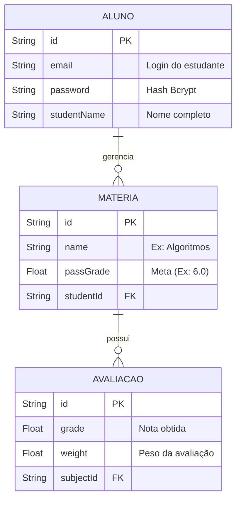

# 🚀 SemDP

  

> **"Porque ninguém merece fazer regra de três no guardanapo para saber se passou."**

O **SemDP** é a ferramenta definitiva para o universitário moderno. Um sistema Fullstack para você gerenciar suas notas, calcular aquelas médias ponderadas complexas e, o mais importante: descobrir exatamente quanto falta para não pegar aquela Dependência (DP) marota.

---

## ✨ Novidades da Versão 2.0

### 🌐 Link (domínio) do Projeto
* O sistema está disponível online em: **[https://semdp.com.br](https://semdp.com.br)**.

### 👤 Perfil do Aluno & Estatísticas
* **Dashboard Pessoal:** Visualize seus dados de cadastro e acompanhe seu progresso acadêmico em um só lugar.
* **Contador de Matérias:** Veja em tempo real o total de disciplinas matriculadas e quantas já foram concluídas com sucesso.

### 🎨 Visual Dinâmico & Interativo
* **Cards Inteligentes:** As bordas das matérias mudam de cor (Verde, Amarelo ou Vermelho) baseadas na sua média atual.
* **Efeito de Confete:** Comemore suas vitórias! O sistema dispara confetes ao atingir a meta de aprovação no simulador.

### 🛠️ Melhorias Técnicas
* **Deploy na HostGator:** Estrutura otimizada para rodar em servidores de produção com suporte a `.htaccess` e Node.js via cPanel.
* **Rodapé Profissional:** Navegação facilitada com links externos para redes sociais abrindo em novas abas.

---

## 🛠️ Tecnologias (O motor debaixo do capô)

| Área | Tech | Pra que serve? |
| :--- | :--- | :--- |
| **Cérebro (Backend)** |  | Onde a mágica acontece. |
| **Rotas** |  | O guarda de trânsito das requisições. |
| **Memória (DB)** |  | Banco NoSQL para persistência de dados. |
| **Tradutor (ORM)** |  | Facilita a comunicação entre o Node e o Banco. |
| **Build** |  | Bundle de frontend rápido e otimizado. |

---

## 🧩 Como os dados se relacionam?

## 📸Screenshots

---
## 🚀 Como Iniciar

1. **Instalação**: Instale todas as dependências do projeto executando `npm install` no terminal da pasta raiz.
2. **Configuração**: Configure o arquivo `.env` (ou variáveis de ambiente no painel do host) com a sua `DATABASE_URL` do MongoDB/MySQL e o `JWT_SECRET` para autenticação.
3. **Build**: Gere a pasta de produção executando `npm run build`. Certifique-se de que o `index.html` está na raiz para evitar erros de resolução.
4. **Deploy**:
   - Suba o conteúdo da pasta `dist` para a `public_html` da HostGator.
   - Configure o arquivo `.htaccess` para suportar as rotas do Vite.
   - Inicie o servidor Node.js através do painel "Setup Node.js App" do cPanel.

---

**Desenvolvido por [Guilherme Nunes](https://github.com/seu-usuario).**
